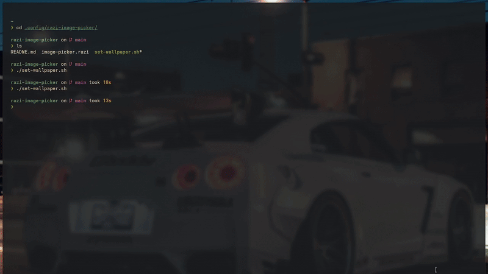

# 🌄 Rofi Wallpaper Picker

A simple and elegant **wallpaper selector** powered by **Rofi**.  
Quickly browse and set wallpapers from your favorite collection with a sleek Rofi menu.


## 🖼️ Preview



## 📁 Project Structure

| File | Description |
|------|--------------|
| **set-wallpaper.sh** | Launches the Rofi interface and applies the selected wallpaper. |
| **image-picker.razi** | Defines the Rofi UI layout and behavior. |


## 🚀 Installation & Usage

```bash
# Clone the repository
git clone https://github.com/SurajKharkwal/rofi-wallpaper-picker ~/.config/rofi-wallpaper-picker

# Make the script executable
chmod +x ~/.config/rofi-wallpaper-picker/set-wallpaper.sh

# Run the wallpaper picker
~/.config/rofi-wallpaper-picker/set-wallpaper.sh
```


## ⚙️ Configuration

If you prefer to store the configuration elsewhere, update the following variables inside **`set-wallpaper.sh`**:

- `WALLPAPER_DIR` — Path to your wallpaper directory.  
- `IMAGE_PICKER_CONFIG` — Path to your `image-picker.razi` configuration file.

If you use a different wallpaper manager (e.g., **feh**, **swww**, **nitrogen**, **hyprpaper**, etc.), modify the **last `if` block** in `set-wallpaper.sh` accordingly.

